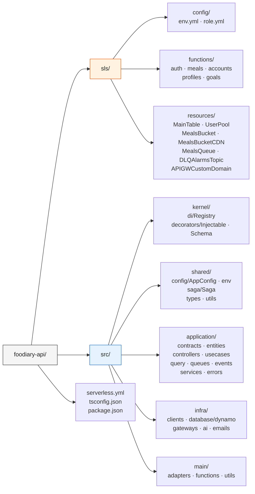
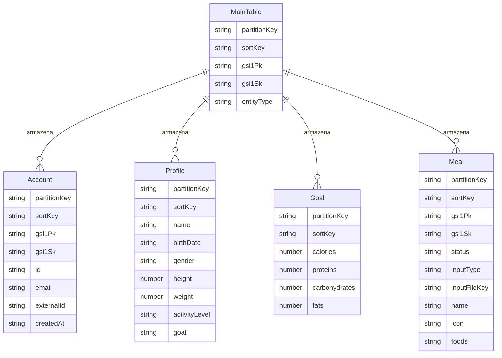

# Foodiary API - Diagrama de Arquitetura

## 1. Camadas da Aplicacao

```mermaid
%%{init: {'themeVariables': { 'primaryTextColor': '#212121' }}}%%
graph TB
  subgraph MAIN["<b>main (Ponto de Entrada Lambda)</b>"]
    direction TB
    LHA["lambdaHttpAdapter<br/><i>API Gateway v2 → Controller</i>"]
    LS3A["lambdaS3Adapter<br/><i>S3 Event → IFileEventHandler</i>"]
    LSQSA["lambdaSQSAdapter<br/><i>SQS Event → IQueueConsumer</i>"]

    subgraph FUNCTIONS["<b>functions/</b>"]
      F_AUTH["signUp · signIn · refreshToken<br/>forgotPassword · confirmForgotPassword"]
      F_MEALS_HTTP["createMeal · listMealsByDay<br/>getMealById"]
      F_MEALS_ASYNC["onMealFileUploaded<br/>processMeal"]
      F_ACCOUNTS["getMe"]
      F_PROFILES["updateProfile"]
      F_GOALS["updateGoal"]
      F_COGNITO["preSignUpTrigger<br/>preTokenGenerationTrigger<br/>customMessageTrigger"]
    end

    F_AUTH --> LHA
    F_MEALS_HTTP --> LHA
    F_ACCOUNTS --> LHA
    F_PROFILES --> LHA
    F_GOALS --> LHA
    F_MEALS_ASYNC --> LS3A
    F_MEALS_ASYNC --> LSQSA
  end

  subgraph APPLICATION["<b>application (Logica de Negocio)</b>"]
    direction TB
    subgraph CONTROLLERS["<b>Controllers</b>"]
      C_AUTH["SignUpController<br/>SignInController<br/>RefreshTokenController<br/>ForgotPasswordController<br/>ConfirmForgotPasswordController"]
      C_MEALS["CreateMealController<br/>ListMealsByDayController<br/>GetMealByIdController"]
      C_ACCOUNTS["GetMeController"]
      C_PROFILES["UpdateProfileController"]
      C_GOALS["UpdateGoalController"]
    end

    subgraph USECASES["<b>Use Cases (Commands)</b>"]
      UC_AUTH["SignUpUseCase<br/>SignInUseCase<br/>RefreshTokenUseCase<br/>ForgotPasswordUseCase<br/>ConfirmForgotPasswordUseCase"]
      UC_MEALS["CreateMealUseCase<br/>MealUploadedUseCase<br/>ProcessMealUseCase<br/>GetMealByIdUseCase"]
      UC_PROFILES["UpdateProfileUseCase"]
      UC_GOALS["UpdateGoalUseCase"]
    end

    subgraph QUERIES["<b>Queries (Leituras CQRS)</b>"]
      Q1["GetProfileAndGoalQuery"]
      Q2["ListMealsByDayQuery"]
    end

    subgraph ASYNC_HANDLERS["<b>Handlers Assincronos</b>"]
      EH["MealUploadedFileEventHandler"]
      QC["MealsQueueConsumer"]
    end

    subgraph DOMAIN["<b>Dominio</b>"]
      ENTITIES["Account · Profile · Goal · Meal"]
      SERVICES["GoalCalculator"]
      ERRORS["HttpError · ApplicationError<br/>EmailAlreadyInUse · InvalidCredentials<br/>ResourceNotFound · etc."]
    end

    C_AUTH --> UC_AUTH
    C_MEALS --> UC_MEALS
    C_ACCOUNTS --> Q1
    C_PROFILES --> UC_PROFILES
    C_GOALS --> UC_GOALS
    C_MEALS --> Q2
    EH --> UC_MEALS
    QC --> UC_MEALS
    UC_AUTH --> ENTITIES
    UC_AUTH --> SERVICES
    UC_MEALS --> ENTITIES
  end

  subgraph INFRA["<b>infra (Implementacoes Externas)</b>"]
    direction TB
    subgraph REPOS["<b>Repositories</b>"]
      R1["AccountRepository"]
      R2["ProfileRepository"]
      R3["GoalRepository"]
      R4["MealRepository"]
    end

    subgraph ITEMS["<b>Data Mappers (Items)</b>"]
      I1["AccountItem"]
      I2["ProfileItem"]
      I3["GoalItem"]
      I4["MealItem"]
    end

    subgraph GATEWAYS["<b>Gateways</b>"]
      GW_AUTH["AuthGateway<br/><i>→ Cognito</i>"]
      GW_STORAGE["MealsFileStorageGateway<br/><i>→ S3</i>"]
      GW_QUEUE["MealsQueueGateway<br/><i>→ SQS</i>"]
      GW_AI["MealsAIGateway<br/><i>→ OpenAI</i>"]
    end

    UOW["SignUpUnitOfWork<br/><i>TransactWrite atomico</i>"]
    EMAILS["React Email Templates<br/><i>ForgotPassword</i>"]

    REPOS --> ITEMS
  end

  subgraph KERNEL_SHARED["<b>kernel + shared (Base)</b>"]
    direction TB
    REGISTRY["Registry<br/><i>Container DI Singleton</i>"]
    DEC_INJ["@Injectable()"]
    DEC_SCH["@Schema()"]
    APP_CONFIG["AppConfig<br/><i>Configuracoes tipadas</i>"]
    SAGA["Saga<br/><i>Compensacao distribuida</i>"]
    ENV["env.ts<br/><i>Validacao Zod das env vars</i>"]
  end

  LHA --> CONTROLLERS
  LS3A --> ASYNC_HANDLERS
  LSQSA --> ASYNC_HANDLERS
  UC_AUTH --> REPOS
  UC_AUTH --> GATEWAYS
  UC_AUTH --> UOW
  UC_AUTH --> SAGA
  UC_MEALS --> REPOS
  UC_MEALS --> GATEWAYS
  UC_PROFILES --> REPOS
  UC_GOALS --> REPOS
  Q1 -.->|"DynamoDB direto"| ITEMS
  Q2 -.->|"DynamoDB direto"| ITEMS
  GATEWAYS --> APP_CONFIG
  REPOS --> APP_CONFIG

  style MAIN fill:#e3f2fd,stroke:#1565c0,color:#212121
  style APPLICATION fill:#e8f5e9,stroke:#2e7d32,color:#212121
  style INFRA fill:#fff3e0,stroke:#e65100,color:#212121
  style KERNEL_SHARED fill:#f3e5f5,stroke:#6a1b9a,color:#212121
  style DOMAIN fill:#e8f5e9,stroke:#1b5e20,color:#212121
  style FUNCTIONS fill:#bbdefb,stroke:#1565c0,color:#212121
  style CONTROLLERS fill:#c8e6c9,stroke:#2e7d32,color:#212121
  style USECASES fill:#c8e6c9,stroke:#2e7d32,color:#212121
  style QUERIES fill:#c8e6c9,stroke:#2e7d32,color:#212121
  style ASYNC_HANDLERS fill:#c8e6c9,stroke:#2e7d32,color:#212121
  style REPOS fill:#ffe0b2,stroke:#e65100,color:#212121
  style ITEMS fill:#ffe0b2,stroke:#e65100,color:#212121
  style GATEWAYS fill:#ffe0b2,stroke:#e65100,color:#212121
```

## 2. Estrutura de Pastas

## 3. DynamoDB - Single Table Design

Chaves da tabela: **PK** (HASH), **SK** (RANGE), **GSI1PK** / **GSI1SK** no indice GSI1.  
Evite nomes `PK`/`SK` dentro do `erDiagram` do Mermaid — o parser trata como palavras reservadas.

**Formato real das chaves (PK/SK) no codigo:**

| Entidade | PK / SK | GSI1 |
|----------|---------|------|
| Account | `ACCOUNT#{id}` | email: `ACCOUNT#{email}` |
| Profile | `ACCOUNT#{id}` / `...#PROFILE` | — |
| Goal | `ACCOUNT#{id}` / `...#GOAL` | — |
| Meal | `ACCOUNT#{id}#MEAL#{mealId}` | `MEALS#{id}#YYYY-MM-DD` / `MEAL#{mealId}` |
