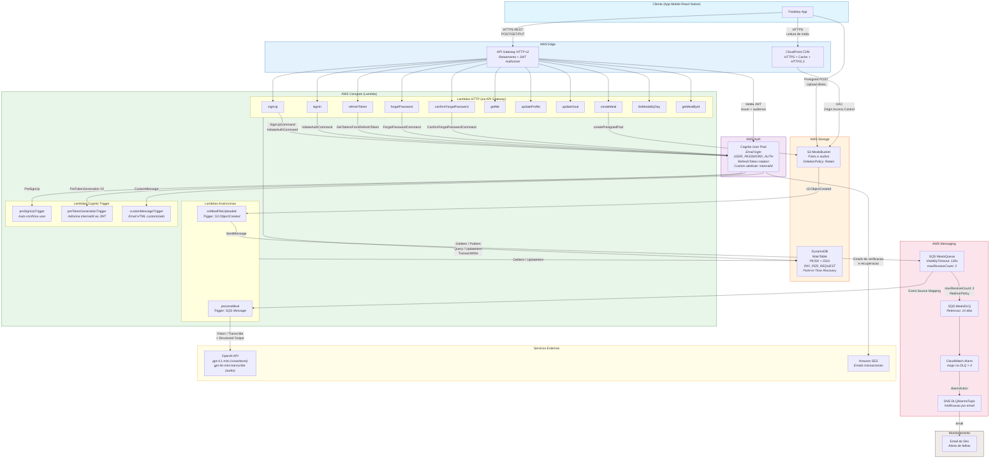
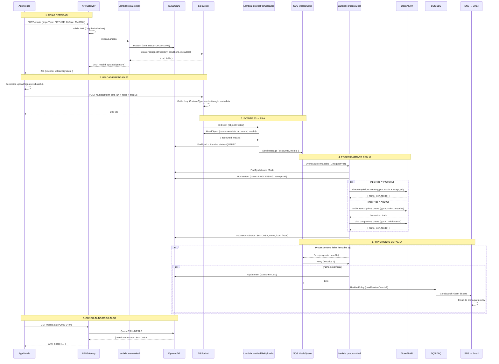
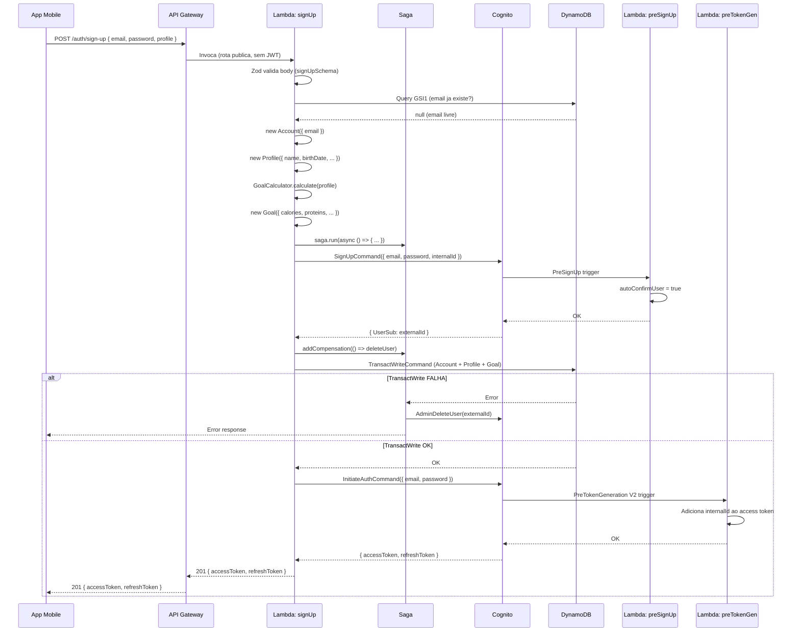
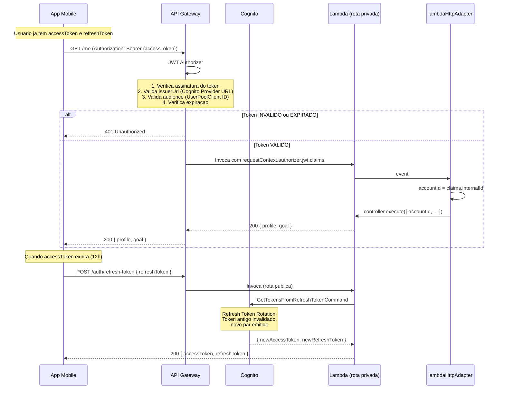
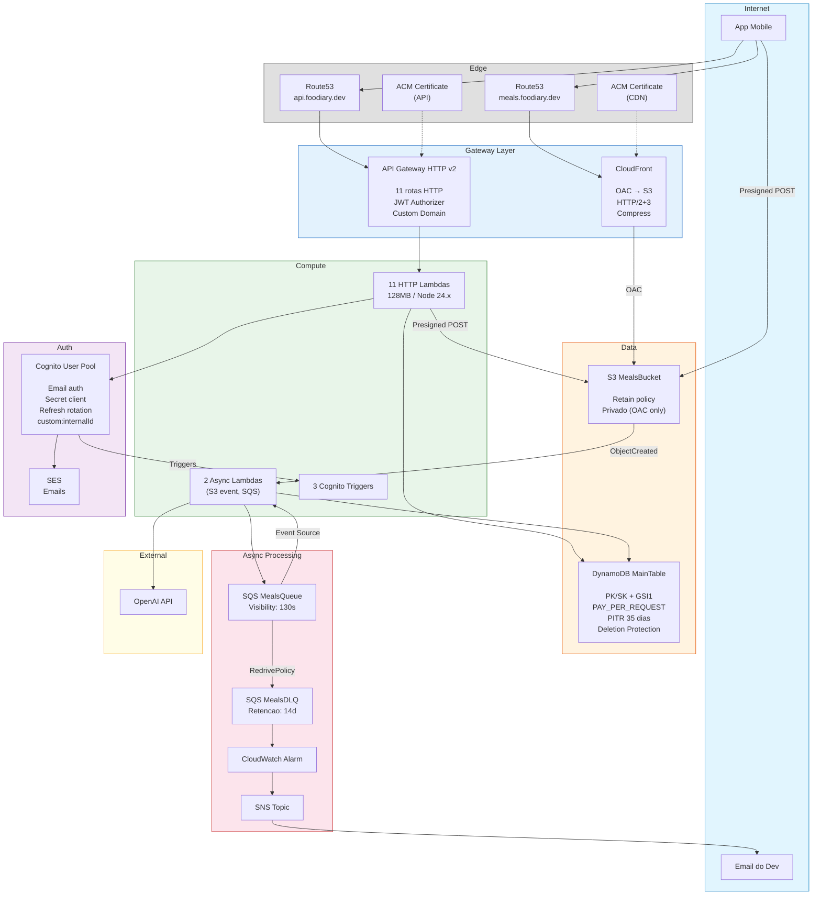

# Foodiary API - Diagrama Geral (Como Tudo se Conecta)

## 1. Visao Completa - Todos os Servicos e Fluxos

## 2. Fluxo Completo: Criar e Processar Refeicao

## 3. Fluxo Completo: Sign Up

## 4. Fluxo de Autenticacao (JWT)

## 5. Mapa de Servicos AWS e Conexoes

