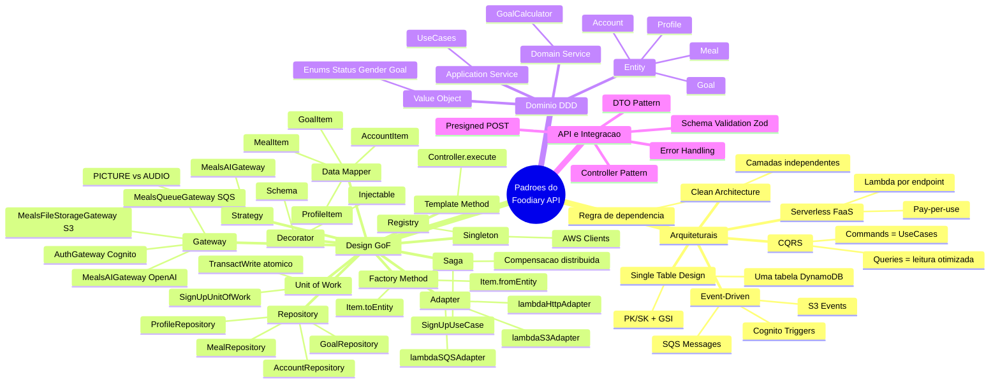
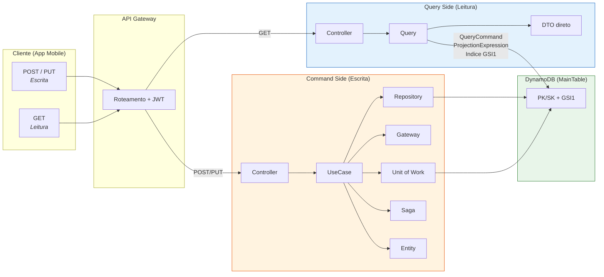
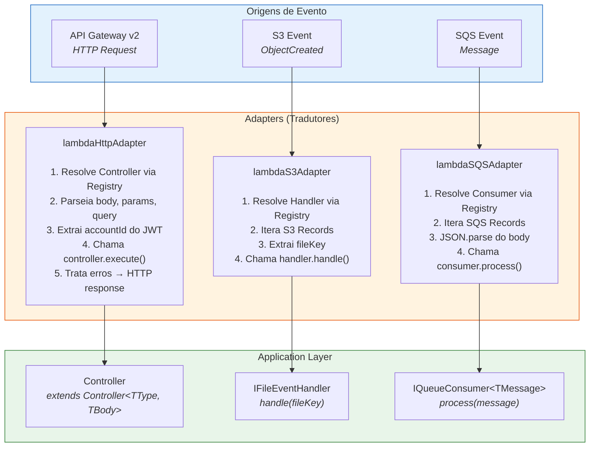
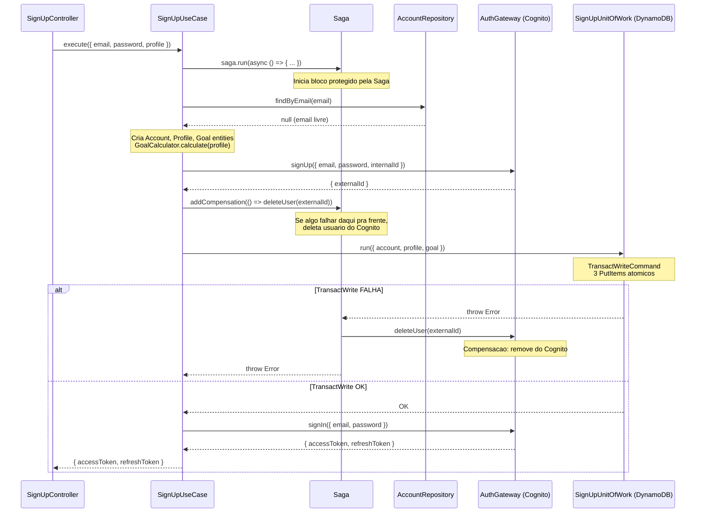
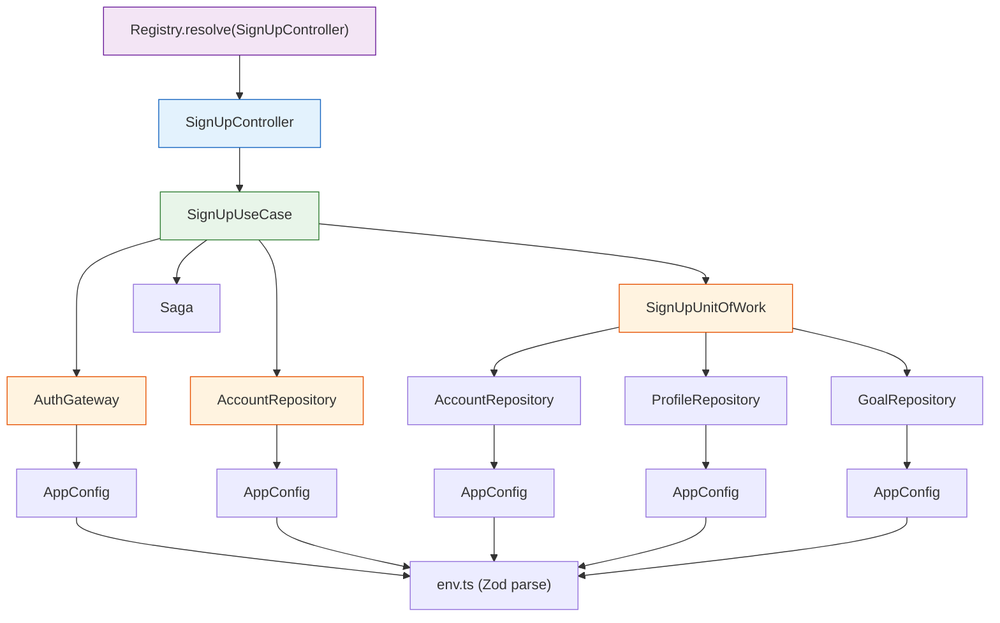
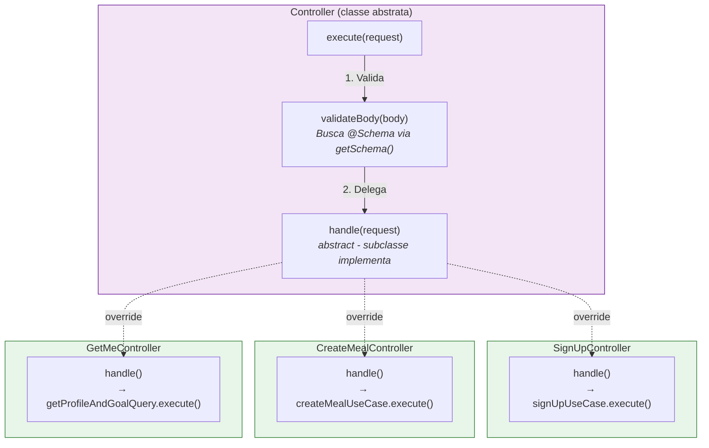
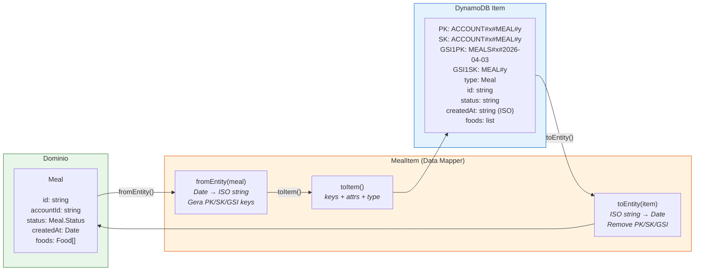
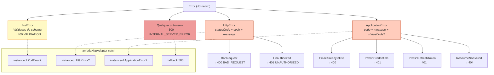
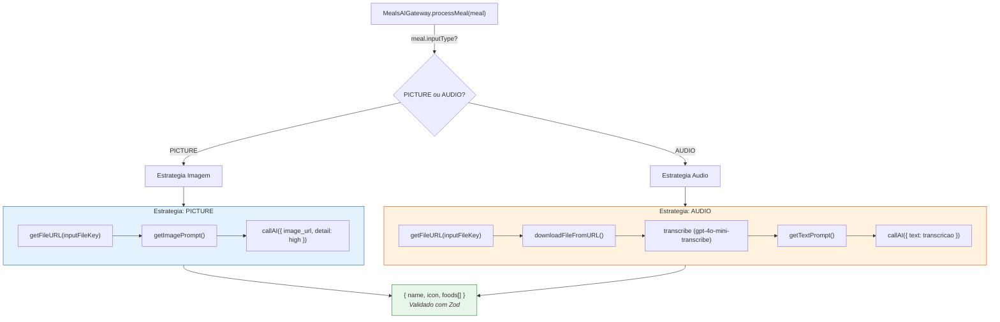

# Foodiary API - Diagrama de Padroes

## 1. Mapa Geral de Padroes

## 2. CQRS - Command vs Query

## 3. Adapter Pattern - Tres Adapters

## 4. Saga Pattern - SignUp

## 5. Dependency Injection - Cadeia de Resolucao

## 6. Template Method - Controller Base

## 7. Data Mapper - Entity ↔ DynamoDB Item

## 8. Error Handling - Hierarquia

## 9. Strategy - Processamento de Refeicao por Tipo

